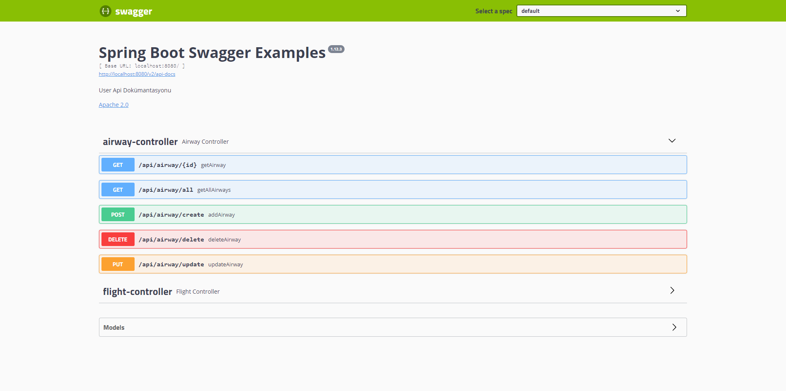
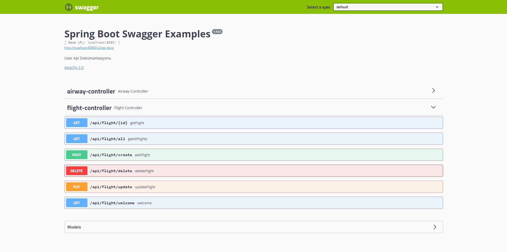

Transaction Control System:
---

Bu projede genel olarak elimizde bulunan uçuş ve havaalanı bilgilerinin alınabilmesi ve bu bilgilere CRUD operasyonlarının uygulanabilmesi işlemleri ele alınmıştır.

Bu projede kullanılan teknolojiler aşağıda verilmiştir.

---

1. Veritabanı olarak PostgreSQL tercih edilmiştir.
2. Java versiyonu olarak 1.8 kullanılmıştır.
3. Arayüz belgeleri oluşturmak, görselleştirmek ve yönetmek için swagger kullanıldı.
4. API'lerin testi için ayrıyeten postman kullanılabilir.
5. Veritabanını yönetim sistemi olarak da hibernate kullanılmıştır.
---

Projede kullanılabilir API'ler aşağıda belirtilmiştir:

Burada CRUD operasyonu için gereken bütün API'lar bulunmaktadır.

---

6 Api'ımız şu işe yaramaktadır.
1. /api/airway/all: Veritabanımızın içindeki bütün havaalanlarını getirmektedir.
2. /api/flight/all: Veritabanımızın içindeki bütün uçuşlarımızı getirmektedir.
3. /api/airway/{id}: Veritabanımızın içindeki verilen spesifik id'ye karşılık gelen havaalanını getirmektedir. 
4. /api/flight/{id}: Veritabanımızın içindeki verilen spesifik id'ye karşılık gelen havaalanını getirmektedir. 
5. /api/airway/create: Veritabanımızın içine yeni bir havaalanı eklememizi sağlamaktadır. 
6. /api/flight/create: Veritabanımızın içine yeni bir uçuş eklememizi sağlamaktadır. 
7. /api/airway/delete: Veritabanımızın içinden verilen spesifik id'ye karşılık gelen havaalanını siler. 
8. /api/flight/delete: Veritabanımızın içinden verilen spesifik id'ye karşılık gelen uçuşu siler. 
9. /api/airway/update: Veritabanımızın içine verilen spesifik id'ye karşılık gelen havaalanını güncelleme işlemi yapar. 
10. /api/flight/update: Veritabanımızın içine verilen spesifik id'ye karşılık gelen uçuşu güncelleme işlemi yapar. 
11. /api/flight/welcome: Welcome to Flight Service! response'unu döndürür.

---
